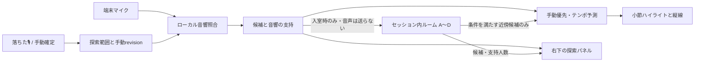

# OKE DYNAMIC — 「落ちた🎙️」とルーム同期の組み込み案

2026-09-26。**設計案。以下の新UI・ルーム通信・投票は未実装。** 組み込みは [#53](https://github.com/kucats/dynamic/issues/53)、音響品質は [#52](https://github.com/kucats/dynamic/issues/52)、既存ローカル機能は [score-following-reader.md](score-following-reader.md) で追跡する。ユーザーの目的は、合奏中に位置を失っても復帰でき、表示が行ったり来たりしないこと。

## 1. 演奏中の操作

1. 右メニューに **「落ちた🎙️」** を置く。小節のコンテキストメニューにも同じ入口を用意する。スクロールして眺めているだけの小節を現在地と断定しない。
2. 基準となる小節と反復回数を表示し、以下の3操作を出す。基準が未選択なら「譜面上の小節を選ぶ」。長休符は既存の小節番号入力を再利用する。
3. 操作後はマイクの状態アイコンと右下の探索パネルを表示する。初回はOSの許可が必要。モジュール読込でユーザー操作の有効期間が失われる端末では、パネルの「マイク開始」を明示的に押して開始する。許可待ち・収録中・停止を区別する。
4. 右下には「探索中」「予測中」「候補あり」と候補最大3件を出す。候補は **近くの練習番号・小節・反復回数** で表し、濃淡は候補の相対的な強さとする。未校正の％を表示しない。
5. 候補を押したときだけ「ここから追う」として手動確定する。候補の順位が変わっても、指で押しかけたボタンの対象を入れ替えない。固定した候補IDを使い、失効した候補は選択後に現在の時刻へ更新して表示する。

| 操作 | 初期の探索範囲 | 現在地への影響 |
| --- | --- | --- |
| ここより後で落ちた | 指定した小節・反復の終わり以後、選択中の楽章末尾まで | 探索条件だけを変更 |
| ここより前で落ちた | 選択中の楽章先頭から、指定小節・反復の開始より前まで | 探索条件だけを変更 |
| この辺で落ちた | 指定小節・反復の前後8小節を初期案とし、端は楽章内に切り詰める | 範囲を光らせる。指定小節への確定ではない |

前後8小節は実演評価前のUI初期値で、パネルで広げる・狭める・全楽章へ戻す操作を用意する。候補が見つからなくても範囲を無断で拡張しない。最初/最後の小節で空になる方向は選べない。反復が曖昧なら両方の範囲を保持し、回数を候補に明示する。

現在地をすでに持っている間は、探索パネルとは別に**最後のBPMで点線カーソルを進める**。探索を開始しただけで既存の手動起点やテンポを破棄しない。初回で現在地がないときは候補の濃淡だけを表示する。明示的なマイク停止は現行どおり位置も止める。ユーザーが「全楽章からやり直す」を選んだときにだけ手動探索範囲を解除する。

右下パネルは折り畳め、狭い画面では下端の小さなシートにする。譜面を覆う面積を抑え、閉じる/停止ボタン、safe area、キーボード・スクリーンリーダー操作を用意する。開始後のアイコンからいつでも収録を止められる。

## 2. ローカルとルームA〜D

「処理する場所」と「他の人と共有するか」を別の設定にする。

| 設定 | 初期状態 | 意味 |
| --- | --- | --- |
| 音声処理：ローカル | 使用可 | iPhone/iPad等の端末内で音を解析 |
| 音声処理：リモート | 無効・準備中 | 将来の音声サーバー。#4の認証・中断対策を満たすまで有効化しない |
| 合奏同期：ひとり | 既定 | ネットワーク同期なし |
| 合奏同期：ルームA/B/C/D | 後段の実験機能 | 同じ練習セッション内で、位置候補だけを共有 |

ルームは「練習セッションの招待ID × A/B/C/D」で分離する。世界中の「A」が接続する設計にはしない。参加画面で作品・楽章を確認し、他人の選択で自分の楽章を自動変更しない。入室して聴くだけの端末はマイクを開かなくてよい。

各自の譜面は異なるパートでもよい。共有位置は共通の作品・楽章・小節・小節内拍・反復の訪問IDで表す。**パートごとの譜面秒数やPDF hashをそのまま共通座標にしない。** 小節長・反復順を含む共通タイムラインに版IDを付け、パートとの変換を検査する。版が不一致なら同期の採用を止め、理由を表示する。未対応の反復を推測で埋めない。

## 3. 多数決と、表示を揺らさない規則

多数決の対象は「今その端末の音で裏付けられた位置候補」。最後のテンポによる予測や、他端末から受け取った候補を再投票しない。これにより、誰かの推測が全端末を回って多数派に見える循環を防ぐ。

初期ルール案（閾値は実演評価で校正する）:

- 認証された参加者ごとに最新の1票枠。再接続・複数タブ・同一参加者の複数端末で票を増やさない。候補が複数なら1票枠を分割し、合計を1以下にする。
- 収録時刻、送受信時刻、往復遅延、候補のテンポを使って同一時刻へ投影し、小節内拍で近傍をまとめる。端末時計のずれと音声窓の遅延を別々に扱う。古い票（初期TTL 2秒）や時刻の不確かな票は棄権とする。
- 音響の支持、別候補との差、鮮度で重みを付ける。未校正の類似度を「正答確率」として混ぜない。各端末の特徴方式・版も記録し、校正できない方式は参考票にする。
- 自動的な近傍補正は、少なくとも3参加者、2パート群から新鮮な支持があり、首位が有効票重みの65%以上、次点と20ポイント以上離れ、2秒以上連続して進行が整合する場合を初期案とする。単独/2人/同パートだけの場合も候補は共有するが、自動補正は行わない。
- 同じパート・同じ抽出方式では誤りが相関しうるため、人数だけで確信度を上げない。表示には「3人が支持」「別候補もあり」等を使い、同じパート中心の支持は分かるようにする。
- 反復の別回は同じ票にまとめない。同点・僅差・分裂時は確定を保留し、最後のBPMで予測を続ける。小節番号の算術平均で、誰も支持していない場所を作らない。
- 自分の近傍補正は現行の位相補正上限と単調進行を守る。**遠方の多数派には勝手に飛ばない。** 遠い候補を選択して移る操作は本人が行う。
- **本人の手動確定が最優先。** 部屋の多数派や管理者の位置変更では解除しない。「この辺/前/後」の探索条件も、部屋の票で広げない。全員への再開位置の提案は別メッセージとし、各自が採用する。

部屋を変える/抜けると旧部屋の候補を破棄する。通信切断中は「ルーム切断・ローカル予測中」を示し、最後のBPMで継続する。再接続時の古い状態、遅延した返答、前の楽章・手動revision・部屋epochの応答は採用しない。

## 4. DYNAMICでの実装境界



- `public/reader/follow-addon.js`：設定・右メニューの入口。必要時だけUIを読み込む。実験設定で有効にしただけではマイクも通信も開始しない。
- `public/reader/follow.mjs` / `follow.css`：マイクアイコン、右下パネル、範囲の濃淡、候補選択、停止。既存の `ext.addBarMenuHook` を使い、選択した小節/反復を渡す。UIの範囲選択と厳密な現在地指定を別イベントにする。
- `public/reader/follow-model.mjs` / `follow-worker.mjs`：探索範囲を検索と候補出力の両方で適用し、世代/revisionを検査する。旧範囲で計算済みの候補も無効化する。既存の手動・予測制御を候補取得方式と分けて維持する。
- `tools/dynamic/following_events.mjs`：現時点の音符列実験。実録音の受入条件を満たすまでreaderへ読み込ませない。部分的に有効なパート/場面でだけ使う採用案も比較する。
- 将来の `follow-room-model.mjs`：DOM/通信から独立した純粋な投票・時刻投影モデル。`follow-room.mjs` は入退室、再接続、表示の仲介だけを担当する。
- 将来の `/api/follow/rooms/*`：認証と短命の参加権限、部屋の隔離、サイズ・頻度制限、最新票の集約。既存メモAPIの保存データへ候補を混ぜない。

サーバーの候補は、現在のCloudflare Workerに **1ルーム=1 Durable Object + WebSocket** を追加する構成。複数接続の調整とWebSocket hibernationは [Cloudflare公式資料](https://developers.cloudflare.com/durable-objects/best-practices/websockets/) に記載されている。現状の `wrangler.jsonc` にはDurable Objectのbindingやmigrationがなく、これは追加設計である。費用・再接続・認証を確認し、別段階で実装・デプロイする。

最小の送信項目案:

```text
session / room / roomEpoch / participantSession / seq
work / movement / canonicalTimelineRevision / part
manualRevision / evidenceOrigin=local-audio / featureVersion
capturedAt / sentAt / estimatedClockError
candidates[<=3]: bar / visitId / beat / tempo / support / ambiguity
```

参加者IDはサーバーが認証から確定し、クライアントの自己申告だけで票を数えない。部屋の返信には `roomEpoch / consensusRevision / contributingParticipants / supportGroups / candidates / expiresAt` を付ける。生音声・スペクトル・音符ごとの演奏履歴は送らない。位置候補は短時間の部屋状態とし、永続履歴にしない。ローカルモードで音声を送らない説明と、入室時に位置候補を共有する説明を分ける。

## 5. 実装順序と受入条件

### P1 — ひとり用「落ちた🎙️」

- [ ] 右メニュー/小節メニュー、3方向、基準小節/反復、範囲変更、右下パネル。
- [ ] 初回許可・拒否・停止・中断・再開の状態。既存の実験設定と矛盾しない。
- [ ] 範囲選択では現在地を確定しない。候補選択で手動起点を更新する。
- [ ] 制約外候補と旧revisionを拒否。既存の手動起点・予測BPM・停止を保護する。
- [ ] 長休符/反復/端の小節/狭い画面/キーボード操作を確認。

### P2 — 音響品質（#52）

- [x] 音符列・発音間隔・置換/挿入/削除を扱うオフライン試作。
- [ ] 独立した録音→小節ラベル、誤捕捉・再捕捉・長休符・小節精度の集計。
- [ ] 完成した譜面からプロフィールを再生成し、調整用と別の録音でも比較。
- [ ] iPhone/iPadの内蔵マイクで遅延・中断・電池負荷を測り、採用する方式を決める。

### P3 — ルームの投票モデル

- [ ] 共通小節/拍/反復座標と版の契約。異なるパート間の変換。
- [ ] 票の上限・曖昧候補の分割・期限・順序・予測票の除外・相関への対策。
- [ ] 2対2の分裂、3対1、全員誤る同一反復、同じパートだけ、古い大量票、複数タブ、clock skew、通信断を人工入力で評価。
- [ ] 本人の手動指定と範囲制約が全ケースで優先される。

### P4 — A〜Dへの参加と通信

- [ ] 認証付き練習セッション、招待、部屋の隔離、入室確認・退室。
- [ ] 実験スイッチの下で位置候補のみ共有。初期は全端末で候補表示のみ。
- [ ] ルーム/楽章/版の変更、切断・復帰、重複・順序逆転の実通信検証。
- [ ] 検証済みの近傍補正を段階的に有効化。遠方への移動は本人の選択。

### P5 — 合奏で採用判定

- [ ] 同じ演奏を複数パート・複数端末で同時評価し、ひとり用とルーム用を比較。
- [ ] 正しい小節の割合、誤った確定、予測のみの時間、復帰時間、手動指定を破った回数を分けて報告。
- [ ] 「フラフラしない」が単に動かない/間違った位置を固定した結果でないか、独立ラベルで確認。
- [ ] 少数端末・全員長休符・同一誤候補・iOSバックグラウンド復帰を含めて受入判定。

本設計の完了と、上記の実装/音符監査/実演精度の達成は別に記録する。
